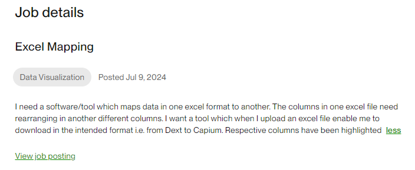
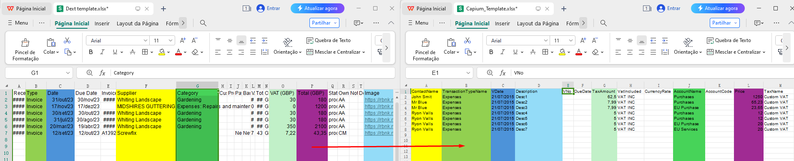
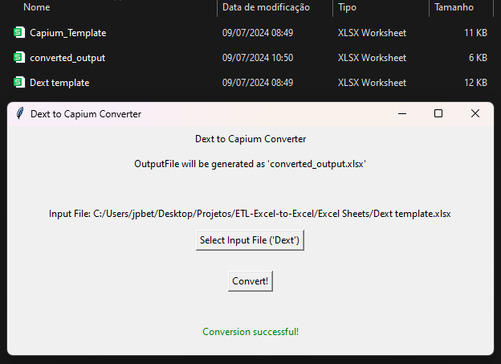

# Dext to Capium Converter

## Overview

The **Dext to Capium Converter** is a tool created to transform financial data from the Dext format to the Capium format. This tool was developed for a specific client to automate the process of rearranging Excel data columns.

## Features

- **Select Excel File:** Choose the input file in Dext format.
- **Convert Data:** Automatically rearranges the data to match the Capium format.
- **Generate Output:** Saves the converted data to a new Excel file named `converted_output.xlsx`.

## How to Use

1. **Run the Application:**

    Execute the `conversor.exe` executable to start the tool:

2. **Select Input File:**

    Click the "Select Input File ('Dext')" button to choose your Dext format Excel file.

3. **Convert Data:**

    Click the "Convert!" button to convert the data. The converted file will be saved in the same directory with the name `converted_output.xlsx`.

4. **Check Results:**

    Look for the new Excel file named `converted_output.xlsx` in the same folder as your input file.

    
